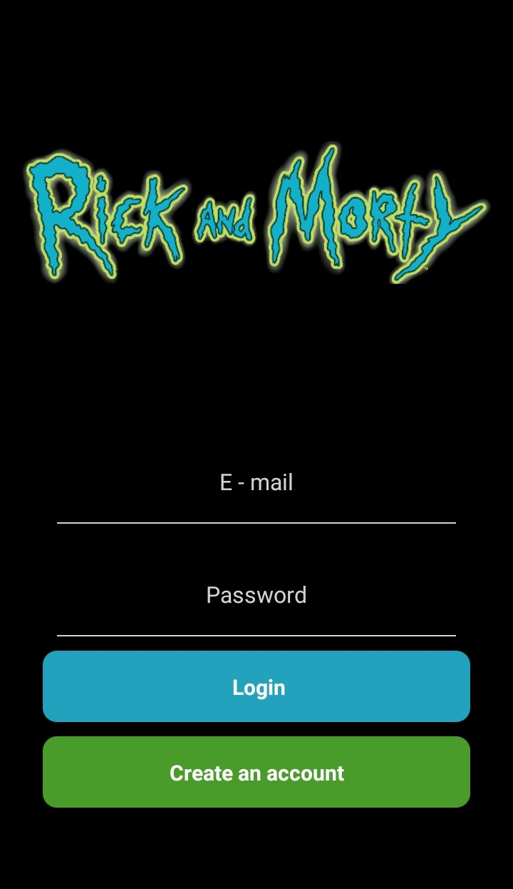
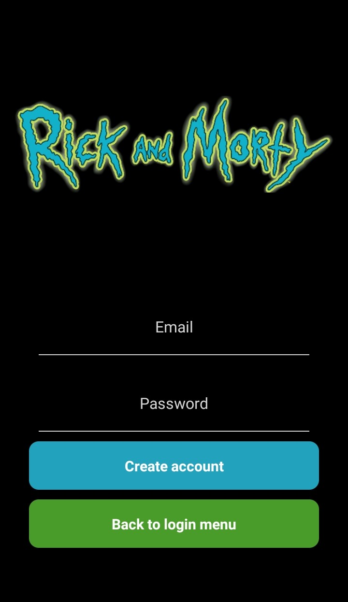
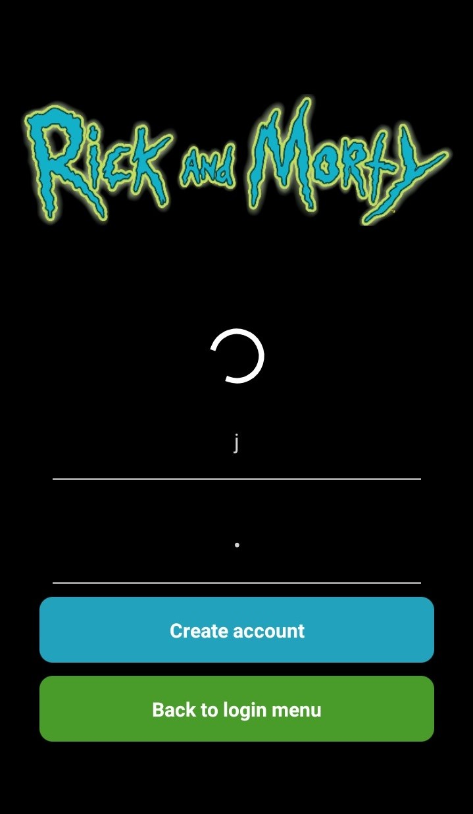

<h1 align="center">Rick and Morty App</h1>
<h2 align="center">
  
  
 
## The App

  

 

  This is an app built in React Native using Expo for the frontend and Node.js/Express.js and MongoDB Atlas for the backend. The app works for both Android and iOS. 
  The app features a login and a signup pages. After the user is authenticated, a list of characters from the cartoon 'Rick and Morty' is displayed. The list is divided in 20 characters per page. The user can mark characters as favorites, which will be saved on the cloud. 
  Both login and signup pages have animated input fields that jump up and down when the page is loaded:
  

 

  The signup page:
  

 

  Whenever the user inputs info in the login and signup pages, a loading animation will be displayed. The animation persists until the server returns an answer:
  

 

The list of characters page:
  

 

  
## Database  
  The database is stored in MongoDB Atlas, a cloud version of MongoDB. Each registry contains the email, password, the ID of the client and an array of favorite characters IDs.
  
## Backend routes

### POST /authUsr
Receives an object with the email and password inputed by the user and compares the data with the information stored in the cloud at the MongoDB Atlas website. Whenever the user inputs something wrong, such as when both email and password fields are empty, an alert informs the user that his/her inputs are wrong.
  
  ### POST /createUser
  Receives an object with the email and password and creates a new account for the client.
 
### POST /favorites
Receives the ID of the client (clientID), the ID of the character (charID) and the flag favAction. If favAction = 1, the character will be added to the favorites. Otherwise, it will be removed.  Returns the updated array of favorites.

## Running the app
  To run the app in a mobile device, first install Expo Go app and scan the following QR code:
   

 

  
